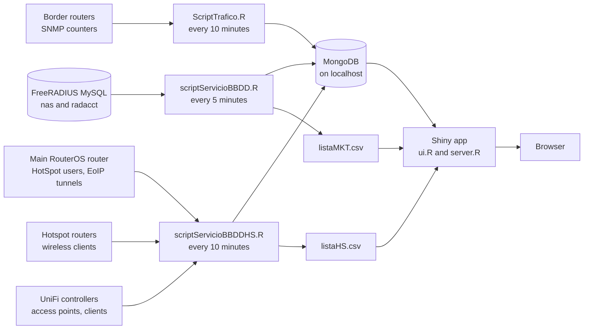

# How it works

StatiX has two halves that share nothing but a MongoDB database and two small text files. Collector scripts read the network and write counts into MongoDB; the Shiny app reads MongoDB and draws.

## The collectors

Each collector is an R script that runs forever: one pass, a sleep, the next pass. A pass that fails prints `ERROR :` and the reason, sleeps five minutes and tries again, so a router or database that is down for a while leaves a gap in the chart and nothing else.

**PPPoE and services** (`scriptServicioBBDD.R`, every five minutes). Reads the `nas` table and the open sessions in `radacct` (those with no stop time). Writes one count per router, the total, and three service counts: data sessions outside the suspension pool, data sessions inside it, and phone sessions. Writes the router list to `listaMKT.csv`.

**Traffic** (`ScriptTrafico.R`, every ten minutes). Reads the inbound and outbound byte counters of three border routers with `snmpget`. On start it takes two readings 30 seconds apart; after that, each pass reads the counters again and compares them with the previous pass stored in MongoDB. The rate is the difference in bytes, times 8, divided by the seconds between the readings and by 1,048,576. It stores the raw counters and the rates per router, and the sum of the three as the total.

**HotSpot** (`scriptServicioBBDDHS.R`, every ten minutes). One pass:

1. Asks the main router for every active HotSpot user: name, MAC, IP, login method, uptime, bytes in and out.
2. Asks the main router for its EoIP tunnels. Each tunnel's remote address is a hotspot router.
3. Asks each hotspot router for its wireless registration table (the MACs of the devices connected to it and their signal), giving each router two seconds to answer.
4. Counts, per hotspot router, the active HotSpot users whose MAC is in its table, and notes each user's hotspot router and signal.
5. Asks both UniFi controllers for their access points and clients. Counts the clients per access point, and for a HotSpot user whose MAC a controller reports, notes that access point and signal instead.
6. Writes one sample per HotSpot user, one count per hotspot router and access point, and the total (every active HotSpot user). Writes the hotspot and access point list to `listaHS.csv`.

## What is stored

Four MongoDB databases. Every document has a `DateTime` in the server's local time, written as text (`2016-03-01 14:05:00`).

| Database | Collections | Each document holds | Written by |
|---|---|---|---|
| `estadisticas` | one per router address; `Total`; `Total Activos`, `Total Impagos y Bajas`, `Total Telefonia` | `PPPoE-Users` | `scriptServicioBBDD.R` |
| `Trafico` | `Ono`, `Aire1`, `Aire2` (one per border router); `Total` | `BytesIN`, `BytesOUT` (the raw counters), `SpeedIN`, `SpeedOUT` (Mbit/s); `Total` holds the speeds only | `ScriptTrafico.R` |
| `estadisticasHS` | one per hotspot router address; one per UniFi access point name; `Total` | `HS-Users` | `scriptServicioBBDDHS.R` |
| `usuariosHS` | one per HotSpot user name | `macs`, `address`, `loginby`, `uptime`, `bytesin`, `bytesout`, `loc`, `signal` | `scriptServicioBBDDHS.R` |

Nothing is ever deleted. Each time a chart redraws, the app loads the whole collection (up to 1,000,000 documents, about nine and a half years at one point every five minutes) and keeps the chosen days in R, so charts get slower as the history grows.

`listaMKT.csv` holds the `nas` table's `nasname` and `shortname`; `listaHS.csv` holds the hotspot names and addresses and the access point names. Both are space-separated, rewritten on every pass, and read by the app when a tab's list is built.

## The app

`ui.R` lays out the five tabs; `server.R` draws them with `ggplot2`. For each chart it connects to MongoDB, reads the collection for the current selection, cuts it to the chosen days, draws it, and schedules the next redraw in five minutes. The HotSpot user search lists the collections of `usuariosHS` and shows the chosen one as a table. The page style is `www/bootstrap.css`, a Bootswatch 3.3.5 theme.

## Security model

- The app has no login and trusts whoever reaches its port. The shipped start script binds it to `127.0.0.1`; reach it through an SSH tunnel or a reverse proxy that asks for a login.
- MongoDB is used with no login, so it must listen on `localhost` only. It holds every HotSpot user's MAC, IP and whereabouts over time.
- The passwords for RADIUS, RouterOS and UniFi are plain text in the scripts. What each account needs:
    - RADIUS: `SELECT` on `nas` and `radacct`. The code's placeholder user is `root`; use a read-only user instead.
    - RouterOS: a user whose group allows the API and reading. The helpers only run `print` commands.
    - UniFi: an account that can list access points and clients.
- SNMP v1 and v2c send the community name in clear text, and the RouterOS API on port 8728 is not encrypted. Keep the collector on the management network.

## Other files in the repository

| File | What it is |
|---|---|
| `AtStartup*.sh` | One line each, starting one collector or the app by absolute path. |
| `scriptServicioBBDDHSdelay.R` | The HotSpot collector with a five-minute wait before its first pass. Run it or `scriptServicioBBDDHS.R`, never both. |
| `poblarTotal.R`, `poblarTotalHS.R` | One-off backfills that rebuild the `Total` collection by adding up the per-router collections. They add documents, so run them only while `Total` is empty. They add rows by position, not by time, so the result is only right when every router's collection has the same samples. Run them from the app directory: they read `listaMKT.csv` and `listaHS.csv` from there. |
| `apiUnifi.py` | A test that prints both UniFi controllers' clients. |
| `script_hotspot.php`, `routeros_api.class.php` | A RouterOS log reader and a PHP RouterOS API class. Nothing in StatiX calls them. |
| `www/favicon.ico`, `www/bootstrap.css` | The app's icon and theme. |
